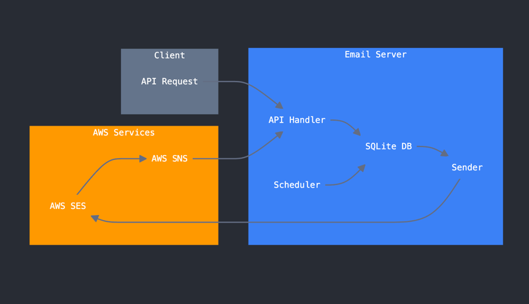
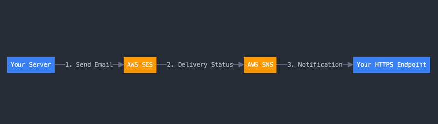

# 📧 AWS SES Email Sender

[한국어](README.ko.md) | [English](README.md)

A high-performance email sending and monitoring server utilizing AWS SES and SNS.
Built with Rust and Tokio for exceptional throughput and reliability.

## 🏗 System Architecture

### Tech Stack
- 🦀 **Backend**: Rust + Axum
- 📨 **Email Service**: AWS SES
- 🔔 **Notification**: AWS SNS
- 🔄 **Async Runtime**: Tokio
- 💾 **Database**: SQLite

### How It Works

#### Immediate Sending Process
1. Receive API request (`/v1/messages`)
2. Store sending request in database
3. Immediately forward to sender via Tokio channel
4. Process sequentially according to AWS SES sending rate limits
5. Asynchronously store sending results

#### Scheduled Sending Process
1. Receive API request (with scheduled_at)
2. Store scheduling information in database
3. Scheduler checks for scheduled tasks every minute
4. Forward scheduled emails to sender when time comes
5. Process using the same flow as immediate sending

### Performance Optimization
- Utilizing Tokio-based async runtime
- Minimizing resource usage with lightweight threads
- Efficient task distribution via channels
- Automatic compliance with AWS SES sending rate limits

## ✨ Key Features

- 🚀 Bulk email sending and scheduling
- 📊 Real-time delivery monitoring
- 👀 Email open tracking
- ⏸ Cancel pending email sends
- 📈 Sending statistics and analysis



## 🔧 Setup Guide

### AWS SES Configuration

[👉 See details: Refer to this blog](https://lee-lou2.notion.site/19d4d6ae33b58092a019ee88de9ca8a0?pvs=4)

#### 1️⃣ Sandbox Mode Removal (Production)
- AWS SES starts in sandbox mode by default
- Request sandbox removal through [AWS Support Center](https://docs.aws.amazon.com/ses/latest/dg/request-production-access.html) for production use

#### 2️⃣ Domain Authentication
- Register domain in AWS SES console
- Add DKIM and SPF records to DNS (using provided records)
- Authentication may take up to 72 hours

#### 3️⃣ Email Address Verification (Sandbox Mode)
- Register sender email in AWS SES console
- Complete verification via confirmation email link

### AWS SNS Configuration (Optional)

#### 1️⃣ Create SNS Topic
- Create new topic in AWS SNS console
- Set topic name for notifications

#### 2️⃣ SES Event Configuration
- Create new configuration in SES Configuration Sets
- Add SNS event destination
   - Events: Bounce, Complaint, Delivery
   - Link to created SNS topic

#### 3️⃣ SNS Subscription Setup
- Add subscription to SNS topic (HTTP/HTTPS, Email, SQS)
- Complete subscription confirmation
   - HTTP/HTTPS: Handle confirmation request at endpoint
   - Email: Click confirmation link



## ⚙️ Environment Variables

```env
# AWS Configuration
AWS_REGION=ap-northeast-2
AWS_ACCESS_KEY_ID=your_access_key
AWS_SECRET_ACCESS_KEY=your_secret_key
AWS_SES_FROM_EMAIL=your_verified_email

# Server Configuration
SERVER_URL=http://localhost:3000
SERVER_PORT=3000
DATABASE_URL=sqlite://sqlite3.db
JWT_SECRET=your_secret_key  # Optional
MAX_SEND_PER_SECOND=12

SENTRY_DSN=your_sentry_dsn  # Optional
```

## 📡 API Guide

### Send Email

```http
POST /v1/messages
```

Handle bulk email sending and scheduling.

```json
{
  "messages": [
    {
      "topic_id": "newsletter_2024_01",  // Custom identifier
      "emails": ["user@example.com"],
      "subject": "January Newsletter",
      "content": "Hello..."  // HTML format
    }
  ],
  "scheduled_at": "2024-01-01 09:00:00"  // Optional
}
```

### Track Results

#### 📨 SNS Event Reception
```http
POST /v1/events/results
```
Receive real-time delivery results from AWS SES:
- ✅ Delivery: Successfully sent
- ❌ Bounce: Delivery failed
- ⚠️ Complaint: Spam report

#### 👁 Email Open Tracking
```http
GET /v1/events/open?request_id={request_id}
```
Track email opens using a 1x1 transparent image.
- Automatically included at email bottom
- Records opens on server automatically
- Identify individual recipients via request_id

### Monitoring & Management

#### 📊 Check Sending Quota
```http
GET /v1/events/counts/sent
```
Check AWS SES daily sending quota and remaining capacity.

#### 📈 Topic Results
```http
GET /v1/topics/{topic_id}
```
Get aggregated results by topic_id:
- Total sent
- Success/failure count
- Open count

#### ⏹ Cancel Sending
```http
DELETE /v1/topics/{topic_id}
```
Cancel pending email sends.
- Cancels all pending emails for topic_id
- Already sent emails cannot be cancelled

## 📚 References

- [AWS SES Developer Guide](https://docs.aws.amazon.com/ses/latest/dg/Welcome.html)
- [AWS SNS Developer Guide](https://docs.aws.amazon.com/sns/latest/dg/welcome.html)